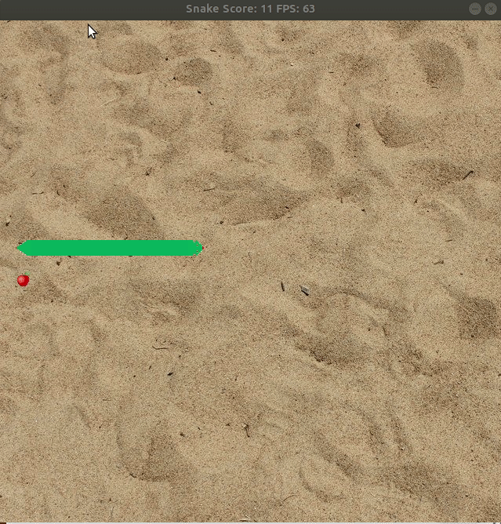

# CPPND: Capstone project 
For the Capstone project in the [Udacity C++ Nanodegree Program](https://www.udacity.com/course/c-plus-plus-nanodegree--nd213) I have chosen to extend the classic Snake game [provided](https://github.com/udacity/CppND-Capstone-Snake-Game) by Udacity.

## Results 
Some new game features have been added to the original project repository. A TODO list can be found at the end of this doc.

Graphical results of the game modification can be seen below. Audio has also been added for special game events, as well as different background music.



## File and class structure
This repo follows the same folder structure as that of the original, with the exception of the creation of a `media` folder, which contains images, fonts and audio files.

A `SoundPlayer` class has been created, which holds smart pointers to the audio media and has an interface to play/halt audio game events and music. This class uses composition to hold objects of type `Song` and type `Chunk`, both of them created to wrap `Mix_Music` and `Mix_Chunk` types.

A pure virtual `Texture` class and two derived classes are responsible for displaying images and text to the screen.

The `Game` class interacts with the `SoundPlayer` class, and the `Renderer` class contains several `Texture` objects so that it can display these textures on the screen.

## Rubric checklist!
The Rubric contains multiple criteria. Only a selection of the criteria have been selected. Of these criteria, only one example is provided as a reference to a location of my source code where this criteria is met.

### Object oriented programming
|Criteria| Explanation | Where |
| --- | --- | ---|
|Object Oriented Programming techniques| Classes encapsulate different functionality | E.g.: {Texture, SoundPlayer}.{h, cpp} files|
|Classes use appropriate access specifiers for class members.| Public, private and protected specifiers used | E.g.: Texture.h |
|Class constructors utilize member initialization lists.| Indeed | E.g.: [Texture constructor](src/texture.cpp), line 4.|
|Classes abstract implementation details from their interfaces.| Classes try to reduce using SDL C interfaces and wrap this functionality. | E.g.: [SoundPlayer and subclasses](src/soundplayer.h)|
|Classes encapsulate behavior.| Raw Pointers used in C library are hidden using class wrappers| E.g.: [SoundPlayer and subclasses](src/soundplayer.h)|
|Classes follow an appropriate inheritance hierarchy.| Common code is shared through pure virtual class | [Texture base class and derived](src/texture.h)|
|Derived class functions override virtual base class functions| Indeed | [Texture base class and derived](src/texture.h)|

### Memory Management
|Criteria| Explanation | Where |
| --- | --- | ---|
|Use of references in function declarations| Although I have not designed it myself and was already part of the Snake example repo | [Game::Run](src/game.h) |
|The project uses destructors appropriately.| All defined classes use destructors to free owned memory and/or call cleaning-up SDL functions | E.g.: [Renderer destructor](src/renderer.cpp), line 69.|
|Use of Resource Acquisition Is Initialization (RAII) where appropriate.| Raw pointers are wrapped by smart pointers, which are owned by class objects | E.g.: [SoundPlayer and subclasses](src/soundplayer.h)|
|The project uses smart pointers instead of raw pointers.| Unique_ptrs are used to own data that is pointed to, custom destructors are used to ensure correct deallocation | [Texture base class and derived](src/texture.h), lines 36 and 64|

## Dependencies for Running Locally
* cmake >= 3.7
  * All OSes: [click here for installation instructions](https://cmake.org/install/)
* make >= 4.1 (Linux, Mac), 3.81 (Windows)
  * Linux: make is installed by default on most Linux distros
  * Mac: [install Xcode command line tools to get make](https://developer.apple.com/xcode/features/)
  * Windows: [Click here for installation instructions](http://gnuwin32.sourceforge.net/packages/make.htm)
* SDL2 >= 2.0
  * All installation instructions can be found [here](https://wiki.libsdl.org/Installation)
  * Note that for Linux, an `apt` or `apt-get` installation is preferred to building from source.
* SDL2 extensions
  * SDL_image, SDL_mixer, SDL_ttf
  * Cross-platform instructions can be found [here](http://lazyfoo.net/tutorials/SDL/06_extension_libraries_and_loading_other_image_formats/index.php)
  * To install these in Ubuntu:

  ```shell
  sudo apt-get install libsdl2-image-dev
  sudo apt-get install libsdl2-mixer-dev
  sudo apt-get install libsdl2-ttf-dev
  ``` 

* gcc/g++ >= 5.4
  * Linux: gcc / g++ is installed by default on most Linux distros
  * Mac: same deal as make - [install Xcode command line tools](https://developer.apple.com/xcode/features/)
  * Windows: recommend using [MinGW](http://www.mingw.org/)

## Basic Build Instructions

1. Clone this repo.
2. Make a build directory in the top level directory: `mkdir build && cd build`
3. Compile: `cmake .. && make`
4. Run it: `./SnakeGame`.

## TODO

- [x] Found and solved bug that caused food to stop appearing on screen.
- [x] Remove hex colors from function calls
  - [x] Create color class
  - [x] Wrap SDL_SetRenderDrawColor
  - [x] Create basic color palette.
- [x] Use modern C++.
  - [x] Use smart pointers.
- [x] Add sounds to game.
  - [x] Add background music.
  - [x] Add food pick-up sound.
  - [x] Add collision sound.
  - [x] Add Game-Over music.
- [x] Add background image.
- [x] Add tail to snake.
- [ ] Add food vanish functionality.
- [x] Add snake head image. (+ rotate accordingly)
- [x] Add snake tail image. (+ rotate accordingly)
- [ ] Add texture to Snake's body.
- [x] Use image to generate food
- [x] Show Game-over.
- [ ] Show score text texture after game over.
- [ ] Allow restart game after game over.
- [ ] Simple menu.
- [ ] Set difficulty.
- [ ] Keep scores.
- [ ] Save custom name with every score.
